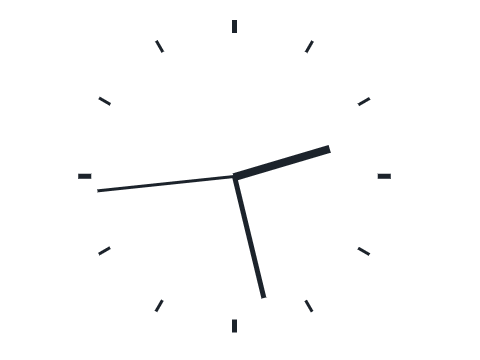
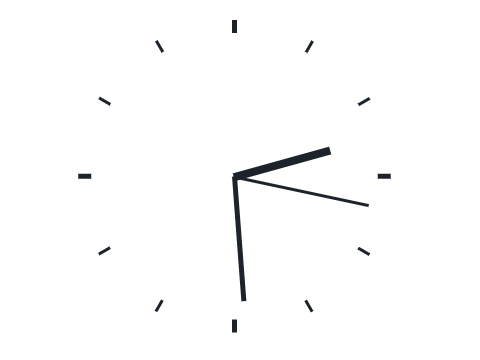

# 아드리엘 프론트엔드 온라인 테스트

### 과제

- 아날로그 시계 구현

### 조건

- SPA framework 중 하나를 사용할 것
- Statement management 라이브러리를 사용할 것

### 목적

- SPA framework 및 Statement management library를 사용하는 이유, 설계 의의를 이해하고 그에 맞게 코드를 작성할 수 있는가
- Component를 적절히 나눌 수 있는가
- **예쁜 디자인은 과제의 목적이 아님**

### 구현 상세

- 화면에는 다음과 같은 내용이 표시됨
  - 현재 시간을 기준으로 한 시침, 분침, 초침(옵션)
  - 시계에 마우스 오버 시 현재 시간을 툴팁으로 표시
    - 툴팁은 마우스 포인터 우상단에 위치
    - 마우스의 움직임을 따라 지속적으로 포지션이 업데이트 되어야 함

### 결과물

- 현재 시간 표시
- 실제 아날로그 시계처럼 초침과 분침 이동에 따라 분침과 시침도 조금씩 이동하도록 구현

- 마우스 오버 시 툴팁으로 현재 시간 표시
  - 툴팁은 24시간제로 표시

### 사용 기술

- React 18.2.0
- Recoil 0.7.6

